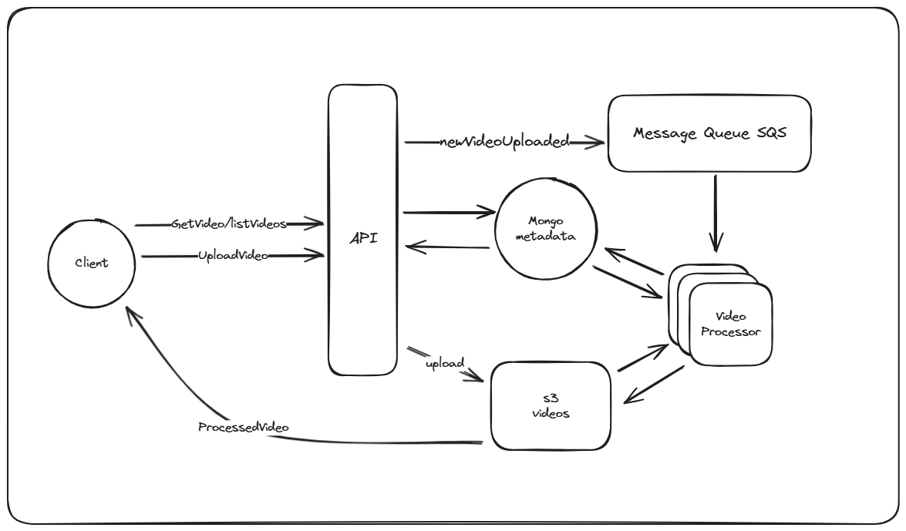

# VIDEO STREAMING BACKEND - PORTFOLIO - NODEJS - AWS
This repository is a nodejs project to showcase my NodeJS skills and my understanding of software development. The repository contains two main services, plus a small one-page html for a simple interface.


The two main services are complemented with different kinds of technologies, this time it's a lot of aws stuff, to make the system more stable and scalable.


This project only runs on docker compose for now, so not helm file included.


### How to get started
To run this project you need `docker` and `docker-compose` installed.


Run following command in root directory


```
docker compose up
```


Import the postman collection, run the `health`-request to make sure its up and running, then initialize localstack with the `init-localstack`-request.


Now you are good to go.


### Architecture
A quick overview of the architecture of the system. For more thoughts on design-choices, see next section.





_the classical load balancer would probably be added in a real project for authentication, ssl-termination and other cool stuff. A CDN would also be beneficial._


#### API
This is the contact point with the client, who is most likely using some kind of app, web or phone. The api has two responsibilities:


* Accepting files for upload and notifying others about new files
* Serving metadata about videos, for retrieval and search


The api is written in TypeScript using NodeJS and ExpressJS.


#### Message Queue (SQS)
Used in the task-queue pattern, for more thought about that see next section. Why SQS? Well, we were already in the aws-world due to s3 and sqs is an easy to use message queue. Any similar message queue would work though. Some traits we would like in this queue are durable to avoid data loss and allow for multiple consumers (from the same "key") to increase concurrency.


I.e. Kafka would not be optimal since it guarantees in-order-processing, so only one message per partition can be processed at the same time. Same goes for a queue that is transient, in other words, loses messages if it goes down.


#### Worker - Video Processor
The worker or the video processor is the other part of the task-queue pattern. It's basically an application written in NodeJS that listens on the SQS queue for incoming "tasks", in this case it's newly uploaded videos.


When a new task arrives, the worker reaches out to the metadata-db to fetch some information about the video, like where the original file is saved. The worker then fetches the video from s3 and begins processing it. The processing of the video is chunking, to allow for partial loading of the video (like buffering), and encoding it into different resolutions to cater for different bandwidth. This processing is done with FFMPEG, an open source tool for encoding and processing videos. There may be better tools out there, but this is good enough for this project since I am trying to showcase my Nodejs and software skills, not video-encoding skills.


The result of the process is then saved to s3 and the metadata-db is updated to reflect this.


#### MongoDB - Metadata-db
MongoDB stores the metadata about the file, right now the data-model is very slim, this was a deliberate choice to make it easier to digest for the reviewer.


I believe a document database is good for storing meta-data about videos, since metadata can be very different depending on the video. However, a relational database would probably work too. Did not put that much time into this decision.


#### S3
S3 is the best* object store out there and is perfect for storing media.


_*according to jeff_


#### One page html
This is more of a dev-tool, to show that the process works. I did not put any time or heart into this file, so it looks really bad. In the future, I may build a vue app, but probably not.


### Patterns
This section contains a small overview on how I structured this service and why.


#### Async Processing with Task queues
The most interesting design choice I made in the project was to split the upload into two parts, the upload and the processing of newly uploaded files. The reason for this is simple: uploading a file may be time consuming compared to other tasks, like hitting a database, but if you compare it to the processing that needs to be done on new videos, then uploading the file is blazing fast.


A quick overview of the pattern:


* User uploads the file to the api-server.
* The api-server saves the file to a persistent storage, and stores some metadata about the file.
* The api-server publishes a message to a queue, in this project it's sqs, but any queue would work.
* The worker(s) gets notified via the queue that a new video needs to be processed.
* The worker(s) process the video, save the processed video to a persistent storage.


Just to get it out of the way, as any other more "complex" pattern, the task-queue pattern adds complexity to the system. It's needed to handle failures across services, it needs extra infrastructure (queue) and makes the system harder to test since the area of effect starts to bridge between code-bases, it makes the system eventually consistent, since videos will not show up directly. However, it often adds more benefits than cons.


The benefits this system get from this system is:


* Scalability - As mentioned, the processing of the video is resource and time consuming, so the load on the user facing api and the processing service probably differs a lot. By using a queue and stateless workers we can simply just spin up more workers if we need to, also, scale down if there are no incoming videos.
* Fault tolerance - By first saving the original file in a persistent storage (s3) we get a natural checkpoint. If the video-processing services goes down, we can simply just work the backlog when it's back up. Same goes if something goes wrong during the processing, then we can just retry the task.
* Availability - The system can still accept new videos even if the video-processing service is down. The videos won't show up to the user directly, but the user can still upload them, and when the video-processor is back up it just starts handling the backlog. This is a much better experience for the user.
* Better user experience - This one is a bit subjective, however, the user probably does not care much about what we do to the file after it's been uploaded. By splitting upload and processing, we can return a 200 to the user quicker, giving an impression that the process is super smooth and fast, or at least not forcing the user to sit and wait for us processing.


I believe this pattern fits perfectly for this task and adds a lot of value to the system.


One change, or further development, is to add the fan-out-pattern to the queue. There are many ways to do this, either with another type of queue like kafka (this would hurt the concurrency of the video-processing though since it will process all messages in order) or adding SNS to the mix.


This would allow for other systems to listen in, and do other types of processing on new videos. Maybe analytics, keeping track of how many new videos we get, or using some kind of OCR/ML to add extra metadata about the video.


#### Serving directly from storage
When a video is requested by a user the server only sends its metadata, the actual video is served directly from s3. This removes redundant networking compared to serving via the server, which would mean that the server would first download it from s3, then send it to the user. A very common pattern for serving media.


To make this better, we would probably use a CDN, having the content cached closer to the users to decrease latency and networking cost.


And a super important thing to add before taking this to production is to use some kind of authentication, right now, the files are served without authentication. Maybe pre-signed urls would be good.


### Testing
Testing is a crucial part of software development, maybe not as fun as writing application code, but not that bad. Since this is a portfolio project I thought that I am not going to put that much time into testing.


I only added a test to one of the files, this file contains the most complex logic, but I will acknowledge this is not enough testing for the project, not even for that file. I do however believe this shows that I can write tests and that I normally do.


I used jest because it's what I always been using when testing with typescript.


### Things I would have done differently / things to improve


* Terraform - I would have added terraform, or any other IAC tool, to handle the creation of the sqs-queue, mongodb and s3 bucket.
* Kubernetes (or other way of deployment) - I would add a helm file for eks, or a script to deploy this ecs.
* The project is missing ci/cd. Here I would add steps for running the test, running terraform and deploying.
* More tests - both unit and integration tests, it's very thin right now.
* Shared code - Right now some code is duplicated between the services, like clients etc. This would probably be in a shared place.
* Research video encodings - some of the choices here have been arbitrary, at best a half qualified guess. So more research into that.
